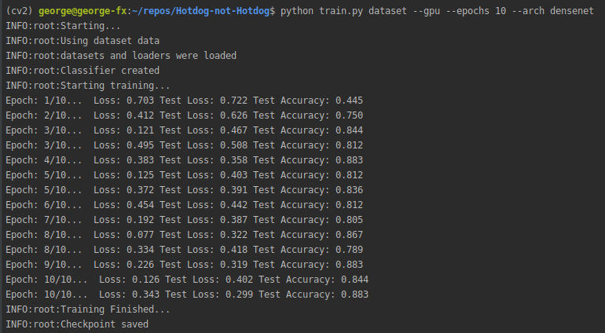
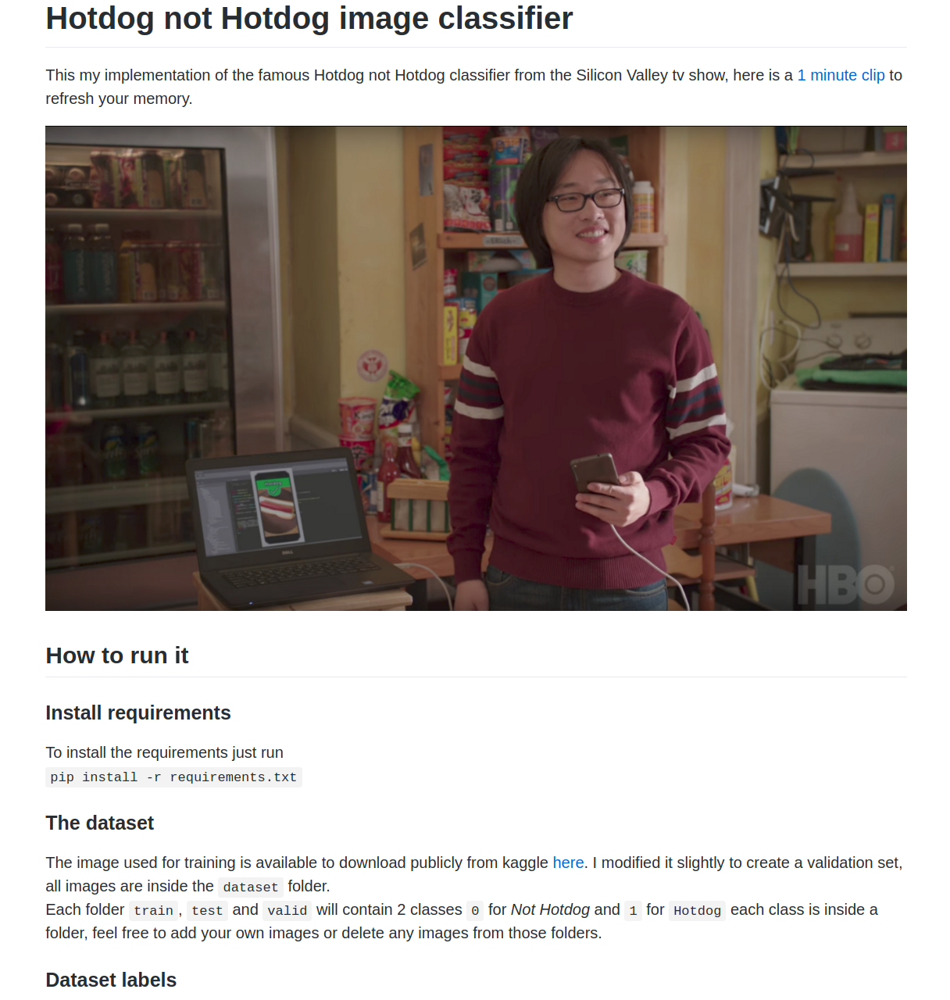

# Image Classifier Creator
This is a simple image classifier creator done with PyTorch, which will help you to create a simple image classifier in minutes.

## How to use this framework
This framework is currently compatible with Densenet and Resnet as pre-trained models to use.

1.  Install the requirements with the following command:   
```pip install -r requirements.txt```

1. You can create your own classifier to use it as the last layers of the model, or you can use the default classifier that I've implemented on the ```network.py``` => ```create_classifier``` function.

1. In order to create the image classifier you will have to add your own images to the ```dataset``` folder, inside you will find the ```train```, ```test``` and ```valid``` folders, each one should have their own images and will be used to train, test and validate the model respectively.

1. The dataset labels are inside the [cat_to_name.json](https://github.com/george-studenko/image-classifier-creator/blob/master/cat_to_name.json) file, you should set the values inside this file accordingly.

1. Once you have your classifier defined and the images in place you will need to run the ```train``` script:
  
To train a model you can use either Densenet or Resnet pre-trained models
* To use the ```--gpu``` to enable gpu when training if you have one
* Set the number of epochs to train with the ```--epochs``` parameter
* Set the pretrained network to use with the ```--arch``` parameter

### Train with GPU for 10 epochs using densenet
```python train.py dataset --gpu --epochs 10 --arch densenet```  
  
  
  
 ### Train with GPU for 40 epochs using resnet
```python train.py dataset --gpu --epochs 40 --arch resnet```  
  
## Checkpoints
Once the training process finishes a checkpoint will be saved automatically inside the checkpoints folder, if a previous checkpoint exists with the default name then the script will overwrite it.

## Sample Image classifier
I've created my own implementation of the ```Hotdog Not Hotdog``` image classifier using this framework:  
  
[Hotdog Not Hotdog repo](https://github.com/george-studenko/Hotdog-not-Hotdog)  
  
  
