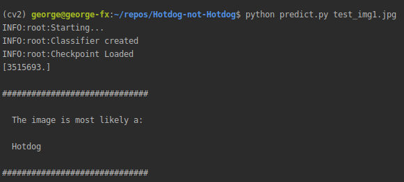
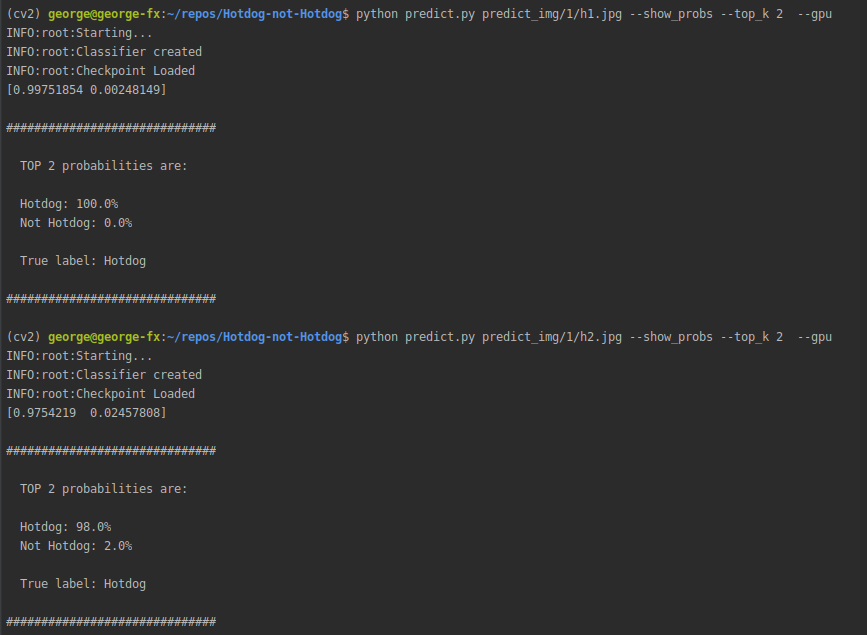

# Image Classifier Creator
This is a simple image classifier creator done with PyTorch, which will help you to create a simple image classifier in minutes.

## How to use this framework
This framework is currently compatible with Densenet and Resnet as pre-trained models to use.

1.  Install the requirements with the following command:   
```pip install -r requirements.txt```

1. You can create your own classifier to use it as the last layers of the model, or you can use the default classifier that I've implemented on the ```network.py``` => ```create_classifier``` function.

1. In order to create the image classifier you will have to add your own images to the ```dataset``` folder, inside you will find the ```train```, ```test``` and ```valid``` folders, each one should have their own images and will be used to train, test and validate the model respectively.

1. The dataset labels are inside the [cat_to_name.json](https://github.com/george-studenko/image-classifier-creator/blob/master/cat_to_name.json) file, you should set the values inside this file accordingly.

1. Once you have your classifier defined and the images in place you will need to run the ```train``` script:
  
To train a model you can use either Densenet or Resnet pre-trained models
* To use the ```--gpu``` to enable gpu when training if you have one
* Set the number of epochs to train with the ```--epochs``` parameter
* Set the pretrained network to use with the ```--arch``` parameter

## train.py params
#### Mandatory params
The first param is mandatory and it is the path to the dataset folder, example:  
```python train.py dataset```  
#### Optional params
* ```--save_dir``` is the folder where checkpoints will be saved default value ```checkpoints/```  
* ```--arch``` is the Pretrained model architecture to use for image classification possible values are ```resnet``` and ```densenet``` default value ```densenet```  
* ```--learning_rate``` specifies the Learning rate to be used default value ```0.0015```    
* ```--epochs``` number of Epochs for the training default value ```15```      
* ```--hidden_units``` Hidden units to use in the classifier default value ```512```  
* ```--number_of_classes``` Number of classes to classify, it is being used as the output of the classifier default value ```2``` (for binary classifiers)  
* ```--gpu``` specifies if you want to use GPU for training if not specified it will use CPU
    
### Train with GPU for 10 epochs using densenet
```python train.py dataset --gpu --epochs 10 --arch densenet```  
  
  
  
### Train with GPU for 40 epochs using resnet  
```python train.py dataset --gpu --epochs 40 --arch resnet```    
  
## Checkpoints
Once the training process finishes a checkpoint will be saved automatically inside the checkpoints folder, if a previous checkpoint exists with the default name then the script will overwrite it.

## Inference
To run a prediction or infere if an image is a ```Hotdog``` or a ```Not Hotdog``` I've included some images that are not part of the dataset used previously inside the folder ```predict_img```
Inside that folder I created 2 subfolders, one for each class in order to get the true label printed out, but this is not necesarily a requirement.  

## predict.py params
#### Mandatory params
The first param is mandatory and it is the image_path to the image you want to classify example:  
```python predict.py predict_img/0/nh1.jpg```    
#### Optional params
* ```--checkpoint_folder``` Path to checkpoint folder default value ```checkpoints```
* ```--checkpoint_file``` Checkpoint file name inside the checkpoint_folder default value ```checkpoint.pth```
* ```--top_k``` Top K probabilities to show default value ```1```
* ```--category_names``` Category names json file default value ```cat_to_name.json```
* ```--gpu``` use GPU for inference if not specified it will use CPU
* ```--show_probs``` Show Probabilities percentages if not specified it will not show this information, there is a screenshot below that explains this param more in detail below

### Making a prediction with the default checkpoint

Without GPU and True Label (only images inside the predict_img will print a true label)  
```python predict.py predict_img/0/nh1.jpg```  
  
With GPU and True Label  
```python predict.py predict_img/1/h1.jpg --gpu```  

Without GPU and without true label    
```python predict.py test_img1.jpg```  
  


```python predict.py test_img2.jpg --show_probs```  
  
  

Please note that ```show_probs``` is at the moment working only for ```densenet```, the values for ```resnet``` won't be correct.  

Predict with top_k parameter  
```python predict.py predict_img/1/h1.jpg --show_probs --top_k 2  --gpu```  
  



Top_k indicates that we want to get probabilities for the top k classes (since this is a binary classifier k max values is 2)
  

## Sample Image classifier
I've created my own implementation of the [Hotdog Not Hotdog repo](https://github.com/george-studenko/Hotdog-not-Hotdog)   image classifier using this framework:  
  
  

You can use that repo as an example.

## Collaborating with the repo
Pull requests are welcome, either for fixing bugs or implementing new pre-trained networks or customizable params.
